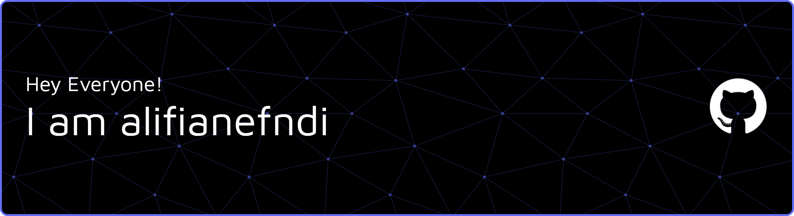

  <h3>Informatics Engineering | Fullstack Developer</h3>
  
<em>"Transforming imaginative ideas into responsive, functional, and visually stunning digital interfaces."</em>

 

## 💡 About Me

- 🎓 Currently pursuing a degree in **Informatics Engineering (Computer Science)**.
- 💻 **Core Focus:** Designing and building *responsive user interfaces* that deliver exceptional user experiences (UX) across all devices.
- 🤖 **Currently Exploring:** Diving deep into the world of **AI Agents** and exploring how artificial intelligence can be seamlessly integrated into modern web application ecosystems.
- 🤝 Always open to creative collaborations, brainstorming innovative app ideas, or discussing web technologies.

 

## 🛠️ Tech Stack & Tools

I utilize a variety of modern tools to bring my ideas to life:

 

## 🧪 Creative Lab (Work in Progress)

While I am currently focusing on honing my technical skills and experimenting with modern web architectures, I am brewing a few exciting projects behind the scenes. 

 

---

<h3 align="center">📫 Let's Connect with me!<h1/>

  
  
  

